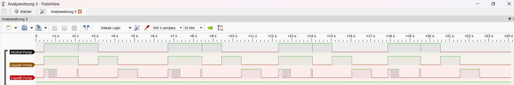
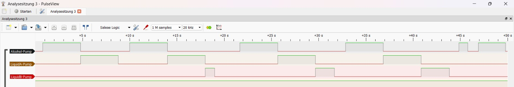
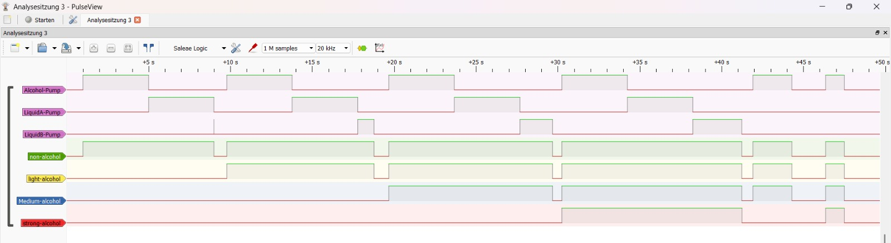

# Pump Control System - TEB

**Automatisches Getränkemischsystem mit Arduino**

## Übersicht

Dieses Projekt steuert ein automatisches Pumpensystem zum Mischen von Getränken mit unterschiedlichen Alkoholstärken. Das System verwendet einen Arduino Uno zur Steuerung von drei Pumpen (Flüssigkeit A, Flüssigkeit B und Alkohol) basierend auf Benutzerauswahl über Tasten.

## Hardware

### Komponenten
- **Mikrocontroller**: Arduino Uno
- **Pumpen**: 3 Stück (PUMP_A, PUMP_B, PUMP_C)
- **LEDs**: 4 Stück zur Statusanzeige (Grün, Gelb, Blau, Rot)
- **Taster**: 5 Stück (4 Optionen + 1 Not-Stopp)

### Pin-Belegung

| Komponente | Pin | Beschreibung |
|------------|-----|--------------|
| LED Grün | 7 | Nicht-alkoholisches Getränk |
| LED Gelb | 8 | Leicht alkoholisch |
| LED Blau | 9 | Mittel alkoholisch |
| LED Rot | 10 | Stark alkoholisch |
| Pumpe A | 11 | Flüssigkeit A |
| Pumpe B | 12 | Flüssigkeit B |
| Pumpe C | 13 | Alkohol |
| Taster 1 | 6 | Option 1 (nicht-alkoholisch) |
| Taster 2 | 5 | Option 2 (leicht) |
| Taster 3 | 4 | Option 3 (mittel) |
| Taster 4 | 3 | Option 4 (stark) |
| Emergency-Stopp | 2 | Stopp-Taste |

## Funktionen

### Getränke-Optionen

1. **Option 1 (Grün)**: Nicht-alkoholisches Getränk
   - Flüssigkeit A: 4000ms
   - Flüssigkeit B: 4000ms
   - Alkohol: 0ms

2. **Option 2 (Gelb)**: Leicht alkoholisches Getränk
   - Flüssigkeit A: 4000ms
   - Flüssigkeit B: 4000ms
   - Alkohol: 1000ms

3. **Option 3 (Blau)**: Mittel alkoholisches Getränk
   - Flüssigkeit A: 4000ms
   - Flüssigkeit B: 4000ms
   - Alkohol: 2000ms

4. **Option 4 (Rot)**: Stark alkoholisches Getränk
   - Flüssigkeit A: 4000ms
   - Flüssigkeit B: 4000ms
   - Alkohol: 3000ms

### Setup-Phase

Beim Start (oder nach Reset) führt das System eine **Füllphase** durch:
- Alle Pumpen werden nacheinander für je 1000ms aktiviert
- Gesamtdauer: 3 Sekunden
- Zweck: Leitungen mit Flüssigkeit füllen

### Sicherheit

- **Not-Stopp-Funktion**: Stoppt alle Pumpen sofort und setzt das System zurück
- **Entprellung**: 80ms Entprellzeit für alle Tasten
- **Automatischer Reset**: Nach Abschluss einer Pumpensequenz

## Software-Struktur

```
Pump_TEB/
├── platformio.ini          # PlatformIO-Konfiguration
├── include/
│   ├── Parameter.h         # Globale Parameter und Variablen
│   ├── Pins.h             # Pin-Definitionen
│   ├── BusIn.h            # Multi-Pin-Eingabe-Klasse
│   └── KeysDebounce.h     # Tasten-Entprellung
├── src/
│   ├── main.cpp           # Hauptprogramm
│   ├── BusIn.cpp          # Implementierung BusIn
│   └── KeysDebounce.cpp   # Implementierung Entprellung
└── README.md              # Diese Datei
```

## Konfiguration

### Timing-Parameter (in `Parameter.h`)

```cpp
#define PUMP_FILLING_TIME 1000      // Füllzeit pro Pumpe (ms)
#define PUMP_TIME_LIQUID_A 4000     // Pumpzeit Flüssigkeit A (ms)
#define PUMP_TIME_LIQUID_B 4000     // Pumpzeit Flüssigkeit B (ms)
#define PUMP_TIME_ALCOHOL 500       // Basis-Pumpzeit Alkohol (ms)
#define TIMER_FACTOR 2              // Multiplikator für Alkohol
```

## Installation & Verwendung

### Voraussetzungen
- [PlatformIO](https://platformio.org/)
- Arduino Uno
- USB-Kabel

### Build & Upload

```bash
# Projekt kompilieren
platformio run

# Auf Arduino hochladen
platformio run --target upload

# Serial Monitor öffnen
platformio device monitor
```

### Bedienung

1. **System starten**: Arduino einschalten oder Reset drücken
2. **Füllphase abwarten**: ~3 Sekunden
3. **Getränk wählen**: Eine der 4 Optionstasten drücken
4. **LED-Anzeige**: Entsprechende LEDs leuchten auf
5. **Automatischer Ablauf**: Pumpen laufen nacheinander
6. **Emergency-Stopp**: Rote Stop-Taste jederzeit drückbar

## Logic Analyzer Beispiel

Die Signale zeigen:
- Alcohol-Pump: Variable Pumpzeit je nach Stärke
- LiquidA-Pump: Konstant 4000ms
- LiquidB-Pump: Konstant 4000ms
- 4-LED-Gruppe for alcohol level.

## Protocol

### Ablauf-Diagramme

**Bild 1: Setup-Phase**


**Bild 2: Pumpensequenz - Normal Betrieb**


**Bild 3: Not-Stopp Verhalten**


### Sequenz-Ablauf

1. System startet → Setup-Phase (3 Sekunden)
2. Benutzer wählt Option (Taste 1-4)
3. LED leuchtet auf
4. Pumpen laufen sequenziell
5. Nach Abschluss: System zurückgesetzt

## Entwickler

- **Autoren**: Nkwamou Jordan, Adrian Maurer
- **Datum**: Oktober 2025
- **Version**: 1.0

## Lizenz

Dieses Projekt wurde für das TEB-Modul entwickelt.

## Bekannte Probleme & ToDos

- [ ] Erweiterte Fehlerbehandlung hinzufügen
- [ ] LCD-Display für Benutzerausgabe integrieren
- [ ] Füllstandssensoren implementieren
- [ ] Kalibrierungsfunktion für Pumpenzeiten

## Kontakt

Bei Fragen oder Problemen erstellen Sie ein Issue im Repository.
